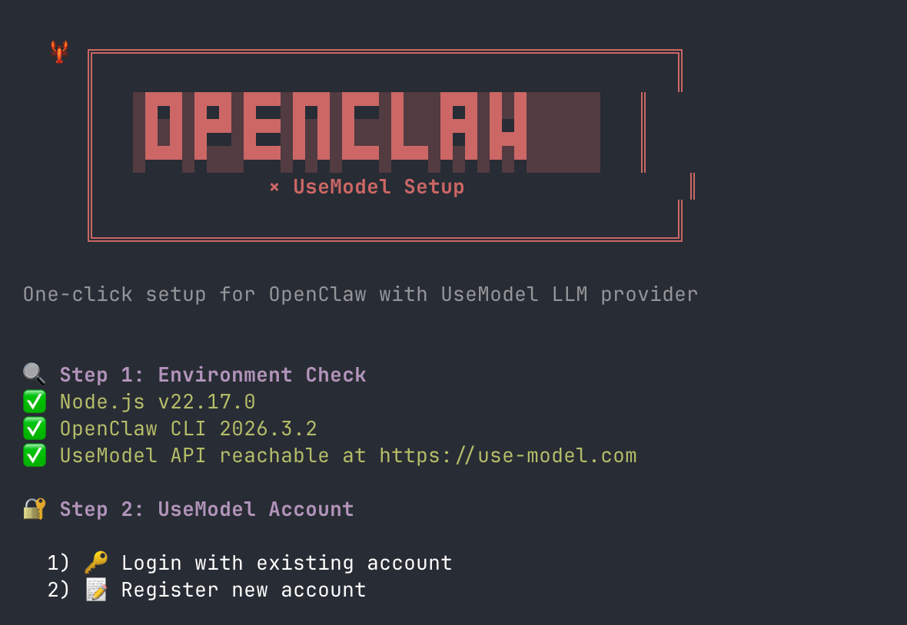

# 🦞 OpenClaw + UseModel 一键配置脚本

[English](./README.md)

## 这是什么？

一个一键配置脚本，让 [OpenClaw](https://github.com/openclaw) 使用 [UseModel](https://use-model.com) 作为 LLM 提供商。运行一条命令，即刻开始使用。

**🎁 每个新账户赠送 $1 免费额度 — 立即开始使用 AI 模型！**

## 功能特性

- ✅ 自动检测并安装 Node.js（支持 nvm / fnm / brew）
- ✅ 注册或登录 UseModel 账户
- ✅ 自动创建 API 密钥（有效期 1 年）
- ✅ 自动配置 OpenClaw 使用 UseModel
- ✅ 自动安装 OpenClaw CLI
- ✅ 智能合并已有 OpenClaw 配置（不覆盖你的设置）

## 快速开始

```bash
curl -fsSL https://use-model.com/scripts/openclaw-setup.sh | bash
```

或者手动下载运行：

```bash
git clone https://github.com/user/use-model.git
cd use-model/scripts
chmod +x openclaw-setup.sh
./openclaw-setup.sh
```

## 截图展示



脚本会引导你完成整个配置流程：

1. **环境检测** — 检查 Node.js、curl 和 API 连通性
2. **登录或注册** — 使用已有账户或注册新账户（新账户赠送 **$1 免费额度**）
3. **创建 API 密钥** — 自动创建并保存 API 密钥
4. **配置完成** — 显示 API 端点、默认模型、API 密钥、余额及后续操作指引

## 脚本执行流程

| 步骤 | 操作说明 |
|------|----------|
| **1. 环境检测** | 检查 `curl` 和 `Node.js >= 22` 是否已安装。如未安装 Node.js，提供 nvm、fnm、brew 三种安装方式。检测 UseModel API 连通性。 |
| **2. 账户认证** | 登录或注册 UseModel 账户。新注册包含邮箱验证流程，验证后赠送 **$1 额度**。 |
| **3. API 密钥** | 创建名为 "OpenClaw" 的 API 密钥（有效期 1 年）。如本地配置中已有密钥，则复用。 |
| **4. 配置 OpenClaw** | 写入/合并 `~/.openclaw/openclaw.json` 配置文件。如已有配置，自动备份后合并。 |
| **5. 完成** | 自动安装 OpenClaw CLI（如需要），设置网关模式为 local，并显示后续操作指引。 |

## 默认配置

配置完成后，`~/.openclaw/openclaw.json` 将包含：

```json
{
  "models": {
    "mode": "merge",
    "providers": {
      "usemodel": {
        "baseUrl": "https://api.use-model.com/v1",
        "apiKey": "sk-...",
        "api": "openai-completions",
        "models": [
          {
            "id": "minimax-m2.5",
            "name": "MiniMax M2.5",
            "contextWindow": 128000,
            "maxTokens": 32000
          }
        ]
      }
    }
  },
  "agents": {
    "defaults": {
      "model": {
        "primary": "usemodel/minimax-m2.5"
      }
    }
  }
}
```

## 环境变量

| 变量 | 默认值 | 说明 |
|------|--------|------|
| `USEMODEL_API_BASE` | `https://api.use-model.com` | UseModel API 基础地址 |

## 系统要求

- **curl** — 用于 API 请求
- **Node.js >= 22** — OpenClaw 运行依赖（脚本可自动安装）
- **jq**（可选）— 用于智能合并已有配置

## 配置完成后

```bash
# 启动网关
openclaw gateway
```

## 测试 API 密钥

```bash
curl https://api.use-model.com/v1/chat/completions \
  -H "Authorization: Bearer 你的API密钥" \
  -H "Content-Type: application/json" \
  -d '{"model":"minimax-m2.5","messages":[{"role":"user","content":"hello"}]}'
```

## 常见问题

| 问题 | 解决方案 |
|------|----------|
| `Cannot reach UseModel API` | 检查网络连接。如使用自定义端点，请设置 `USEMODEL_API_BASE` 环境变量。 |
| Node.js 安装后未生效 | 运行 `source ~/.bashrc` 或 `source ~/.zshrc`，然后重新执行脚本。 |
| npm 安装权限不足 | 脚本会自动使用 `sudo` 重试。 |
| 配置合并失败 | 安装 `jq` 以支持配置合并：`brew install jq` 或 `apt install jq`。 |

## 许可证

MIT

---

🦞 由 [UseModel](https://use-model.com) 提供支持
